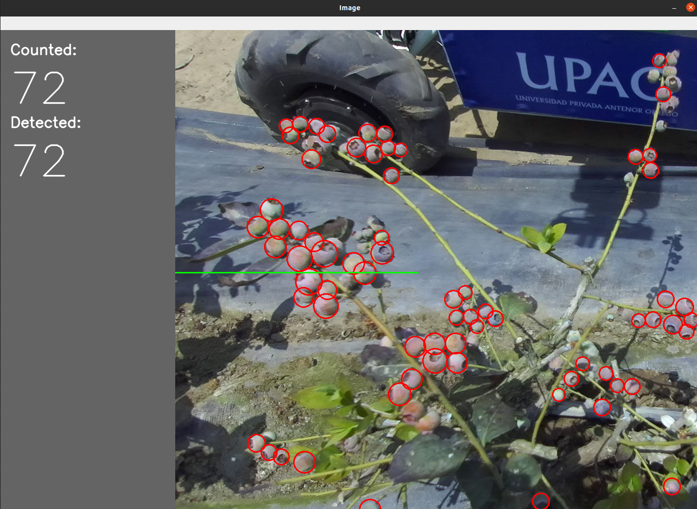

<div align="center">
    <h1>Blueberry-Detection-ROS</h1>

  <p align="center">
    <a href="here_is_a_demo_video"></a>
  </p>

</div>


This is a repository of a computer vision system to detect and classify blueberries in agroindustrial enviroments based on YoloV5/YoloV8 techniques, the model run over a Jetson Xavier.

### Use:

Clone and install all requirements:

```bash
git clone https://github.com/pQbas/blueberry-detection-ros.git
cd blueberry-detection-ros
pip install -r requirements.txt
```

Download the weights and records:

```bash
./weights/download_weights.sh
./records/download_test_records.sh
```

Run YoloV8 for blueberry **counting** using ROS framework:

- Counting in vertical mode

```bash
roscore
rosrun blueberry-detection-ros detection-ros.py -model YOLOV8 \
                                                  -sub 'zed2/zed_node/right/image_rect_color/compressed' \
                                                  -show True \
                                                  -track True \
                                                  -count_mode vertical \
                                                  -threshold 500 \
                                                  -direction top2down
rosbag play records/zed2_rosbag_2023-09-29-11-55-24.bag
```

- Counting in horizontal mode

```bash
roscore
rosrun blueberry-detection-ros detection-ros.py -model YOLOV8 \
                                                  -sub 'zed2/zed_node/right/image_rect_color/compressed' \
                                                  -show True \
                                                  -track True \
                                                  -count_mode horizontal \
                                                  -threshold 500 \
                                                  -direction right2left
rosbag play records/zed2_rosbag_2023-09-29-11-58-00.bag
```

### Publications:

1. Artificial vision strategy for Ripeness assessment of Blueberries on Images taken during Pre-harvest stage in Agroindustrial Environments using Deep Learning Techniques. INTERCON2023. (https://ieeexplore.ieee.org/document/10326058)
2. Detection and Classification of ventura-blueberries in five levels of ripeness from images taken during pre-harvest stage using Deep Learning techniques. ANDESCON2022. (https://ieeexplore.ieee.org/document/9989578)


<!-- Run YoloV5/YoloV8 for blueberry **detection** using ROS framework:

```bash
roscore
rosbag play records/zed2_rosbag_2023-09-29-12-10-05.bag
rosrun blueberry-detection-ros detection-ros.py -model YOLOV5 \
                                                  -sub 'zed2/zed_node/right/image_rect_color/compressed' \
                                                  -show True \
                                                  -track False
```
 -->


<!-- 
# Robot connection

1. SSH conection:

```bash
ssh ubuntu@192.168.0.40
password: pi123456
ssh labinm-jetson@192.168.0.10
password: rpgdini100
```

2. ZED2i:

```bash
roslaunch zed_wrapper zed2i.launch
```

3. blueberry detector activation:

```bash
rosrun blueberry-detection-ros detection-ros.py -model YOLOV8 \
                                                  -sub '/zed2i/zed_node/left/image_rect_color' \
                                                  -show False \
                                                  -track False \
                                                  -count_mode horizontal \
                                                  -threshold 500
```

4. execute rviz to visualize:
```
rviz
```


# Detection Launch

The content of the file: `src/detection.launch`

```yaml
<launch>
  
	<include 
		file="$(find zed_wrapper)/launch/zed2i.launch" 
	/>

	<node 
		pkg="blueberry-detection-ros"
		type="detection-ros.py"
		name="detection_node"  
		output="screen"
	/>

</launch>
```


 -->
